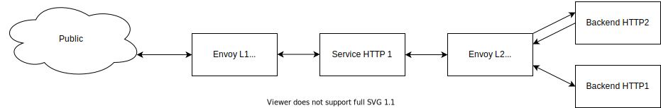

How to handle error pages for frontend microservices architecture nginx vs envoy.

# How it Works

The idea is we're implementing nginx error recursive to response user when error happen. Preparing location error handler and fill it with return static HTML error page when error service also down!.



# Development

```sh
make run-dev
```

# Test

Open [link](https://devel.tokopedia.com) to check result in development